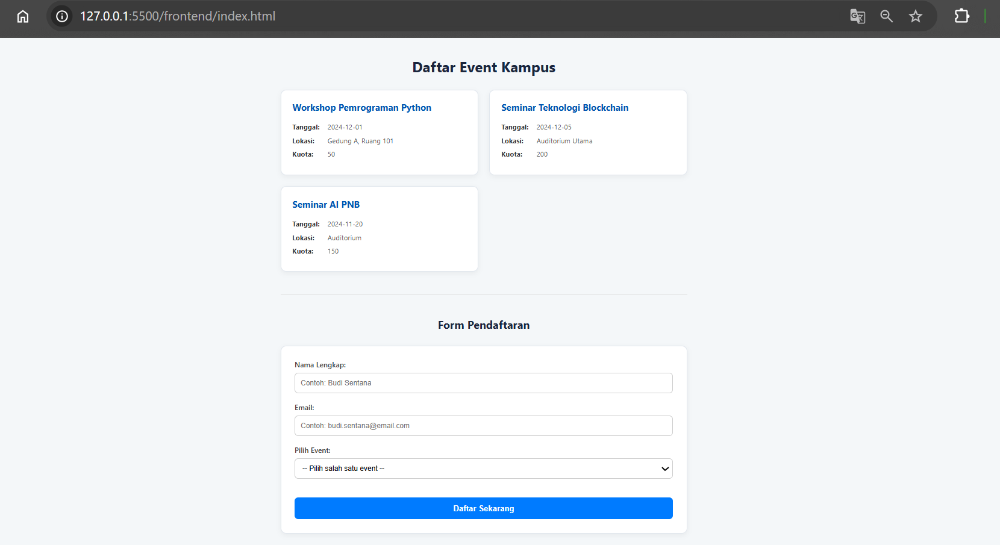
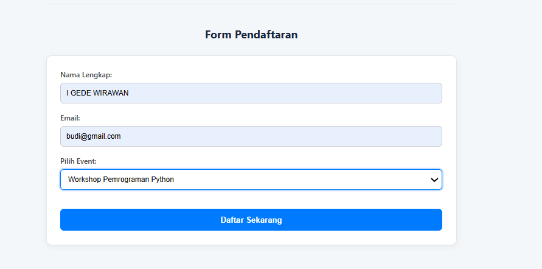
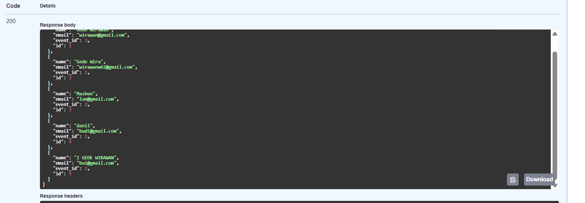
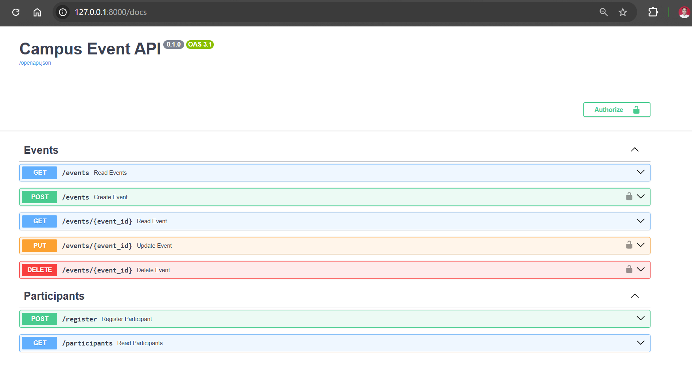
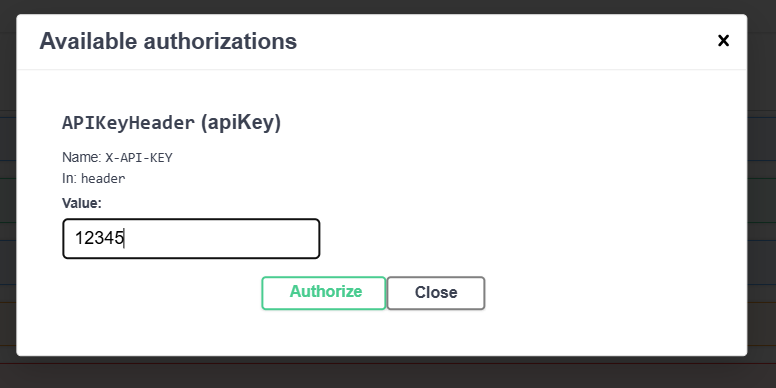
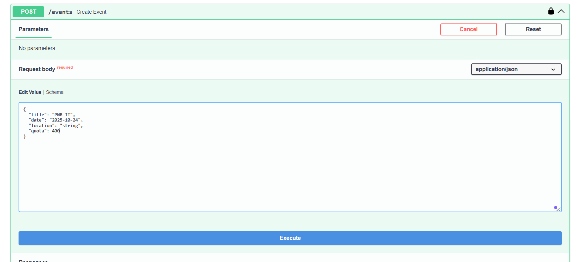
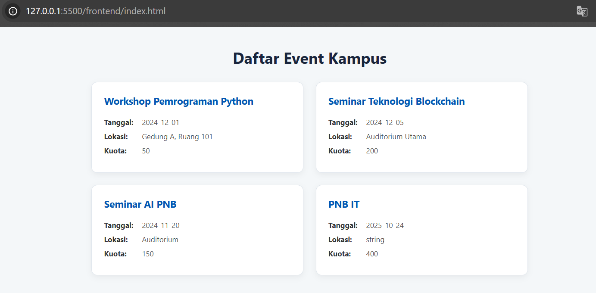

# Proyek UTS Interoperability: Campus Event Registration Platform

**Nama:** I Gede Wirawan </br>
**NIM:** 2315354030 </br>
**Kelas:** 5B TRPL </br>

---

## 1. Deskripsi Proyek

Proyek ini adalah sebuah sistem pendaftaran event kampus sederhana yang dibangun untuk memenuhi Ujian Tengah Semester (UTS) mata kuliah Interoperability. Sistem ini menunjukkan interoperabilitas antara tiga komponen utama:
- **Backend REST API**: Dibangun menggunakan Python dengan framework FastAPI.
- **Database**: Menggunakan SQLite sebagai database relasional yang ringan.
- **Frontend Client**: Berupa halaman web statis (HTML, CSS, JavaScript) yang berkomunikasi dengan backend melalui Fetch API.

Fitur utama sistem ini adalah memungkinkan pengguna untuk melihat daftar event yang tersedia dan mendaftarkan diri sebagai peserta pada event yang dipilih. Selain itu, terdapat fungsionalitas admin untuk mengelola data event (membuat, mengubah, menghapus) yang dilindungi oleh autentikasi berbasis API Key.

## 2. Teknologi yang Digunakan

- **Backend**: Python 3, FastAPI, Uvicorn
- **Database**: SQLite 3
- **ORM**: SQLAlchemy
- **Frontend**: HTML5, CSS3, JavaScript (ES6+)
- **Komunikasi**: REST API, JSON, Fetch API
- **Testing API**: Swagger UI (otomatis oleh FastAPI)

## 3. Cara Menjalankan Aplikasi

Berikut adalah langkah-langkah untuk menyiapkan dan menjalankan proyek ini di lingkungan lokal.

### Prasyarat
- Python 3.8 atau lebih baru
- `pip` dan `venv`
- DB Browser for SQLite (opsional, untuk melihat database)

### Langkah-langkah Instalasi

1.  **Clone Repository**
    ```bash
    git clone https://github.com/wiraputra/interoperability-final-igedewirawan.git
    cd interoperability-final-igedewirawan
    ```

2.  **Buat dan Aktifkan Virtual Environment**
    ```bash
    # Buat virtual environment
    python -m venv venv

    # Aktifkan di Windows
    venv\Scripts\activate

    # Aktifkan di macOS/Linux
    source venv/bin/activate
    ```

3.  **Install Dependencies**
    Pastikan Anda sudah membuat file `requirements.txt` dengan perintah `pip freeze > requirements.txt`.
    ```bash
    pip install -r requirements.txt
    ```

4.  **Inisialisasi Database**
    - Download dan Buka **DB Browser for SQLite**.
    - Klik "New Database" dan simpan dengan nama `campus_events.db` di folder utama proyek.
    - Pindah ke tab "Execute SQL".
    - Salin semua konten dari file `create_db.sql` dan jalankan.
    - Jangan lupa klik **"Write Changes"** untuk menyimpan.

5.  **Jalankan Server Backend**
    Dari direktori utama proyek, jalankan perintah berikut di terminal:
    ```bash
    uvicorn backend.main:app --reload
    ```
    Server akan berjalan. Terminal akan menampilkan pesan: `Uvicorn running on http://127.0.0.1:8000`.

6.  **Buka Aplikasi Frontend**
    Buka file `frontend/index.html` di browser Anda (disarankan menggunakan ekstensi "Live Server" di VS Code). Aplikasi frontend siap digunakan.

7.  **Akses Dokumentasi API (Swagger UI)**
    Setelah server backend berjalan, buka tab browser baru dan kunjungi alamat berikut untuk mengakses dokumentasi API interaktif:
    **[http://127.0.0.1:8000/docs](http://127.0.0.1:8000/docs)**

## 4. Daftar Endpoint API

Dokumentasi interaktif dapat diakses melalui **[http://127.0.0.1:8000/docs](http://127.0.0.1:8000/docs)**.

**API Key untuk Autentikasi Admin:** `12345` (dikirim melalui header `X-API-KEY`).

### Events
| Metode | Path | Deskripsi | Membutuhkan Auth |
|:--- |:--- |:--- |:---:|
| `GET` | `/events` | Mendapatkan daftar semua event. | Tidak |
| `POST` | `/events` | Membuat event baru. | **Ya** |
| `GET` | `/events/{event_id}` | Mendapatkan detail satu event. | Tidak |
| `PUT` | `/events/{event_id}` | Memperbarui data sebuah event. | **Ya** |
| `DELETE` | `/events/{event_id}` | Menghapus sebuah event. | **Ya** |

### Participants
| Metode | Path | Deskripsi | Membutuhkan Auth |
|:--- |:--- |:--- |:---:|
| `POST` | `/register` | Mendaftarkan peserta baru ke sebuah event. | Tidak |
| `GET` | `/participants` | Mendapatkan daftar semua peserta terdaftar. | Tidak |

## 5. Cara Verifikasi Pendaftaran (via Backend)

Jika notifikasi di frontend tidak tampil, keberhasilan pendaftaran dapat diverifikasi secara langsung melalui backend API:

1.  Lakukan pendaftaran seperti biasa melalui form di halaman `index.html`.
2.  Buka halaman Swagger UI di `http://127.0.0.1:8000/docs`.
3.  Cari dan buka endpoint `GET /participants`.
4.  Klik "Try it out", lalu klik "Execute".
5.  Periksa bagian "Response body". Jika data peserta yang baru Anda daftarkan muncul di sana, maka proses pendaftaran **telah berhasil**.

## 6. Screenshot Hasil Uji

Berikut adalah beberapa screenshot yang menunjukkan fungsionalitas aplikasi.

**1. Tampilan Frontend Utama**
*(Pengguna bisa melihat daftar event dan form pendaftaran)*


**2. Verifikasi Pendaftaran Berhasil via Swagger UI**
*(Hasil dari endpoint GET /participants menunjukkan data yang baru saja didaftarkan dari frontend)*

*Mengisi Data yang akan didaftarkan (email yang benar adalah bui@gmail.com)*


*Hasil Pendaftaran masuk ke Swagger UI* </br>
Muncul paling bawah


**3. Dokumentasi API Interaktif (Swagger UI)**
*(Menampilkan semua endpoint yang tersedia, termasuk endpoint yang dilindungi gembok)*


**4. Pengujian Endpoint yang Dilindungi (POST /events)**
*(Contoh pengujian membuat event baru setelah melakukan otorisasi dengan API Key yang valid)*

*Otorisasi API Key*


*Pembuatan Event Baru via POST*


*Event Baru Tampil di Frontend*


---
---
